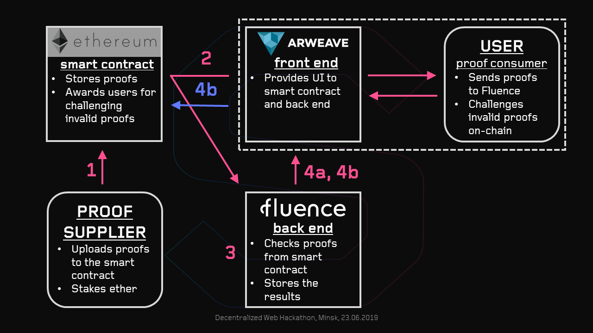

# LAZY SNARK: trustless off-chain zk-proof verification.
## Abstract
In Ethereum, it is expensive to check zk-proofs on-chain, so we propose to use Fluence to do heavy-lifting off-chain and only go on-chain to challenge incorrect proofs. Our project should help exisiting Ethereum projects that rely on zkp to achieve privacy, scalability and other nice qualities.
## Why
Let us say, there is a project that needs to verify zk-proofs in Ethereum smart contract. The problem is that zk-proof verification is a heavy computational task and thus costs a lot of gas. As a result, checking proofs on-chain is expensive, and is susceptible to network congestion. 
## What
We suggest checking proofs on Fluence instead. This option does not has gas problem, is much cheaper, and is trustless. 

## How it works
The process includes the following entities:
- Ethereum smart contract that stores (data, proof) pairs and implements on-chain proof verification. In case the proof is not correct, the smart contract rewards the user who challenged this proof with ether.
- Proof Supplier (e.g. Ethereum project operator) who uploads (data, proof) pairs to the smart contract.
- Fluence back end that implements off-chain proof verification. It also stores proof verification results.
- Proof Consumer (e.g. Ethereum project user). Consumer checks if Supplier provides valid proofs and challenges invalid ones using smart contract to get a reward.
- Arweave front-end. The user performs all the actions via the front end.

Here is an example of workflow:
1. The operator uploads (data, proof) to the smart contract.
2. The user takes (data, proof) from the smart contract and sends it to the back end (Fluence).
3. The back end checkes the proof.
4. a) If the proof is correct, it is stored by the back end with TRUE flag. Other users can see it an will not check this proof again.
   b) If the proof is false, the user challenges that proof in the smart contract. The proof is invalid and thus the user will get the reward.

To better understand the workflow, please review the scheme.

